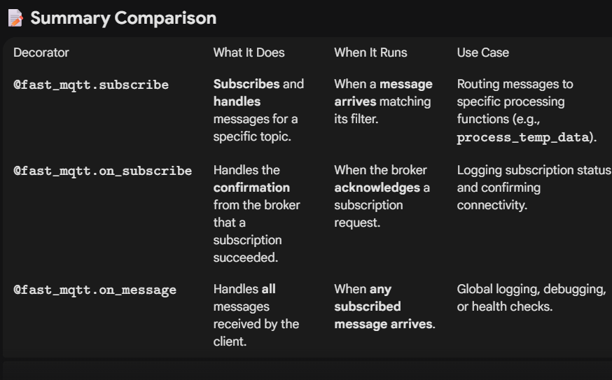

# FastAPI-MQTT
-   https://sabuhish.github.io/fastapi-mqtt/getting-started/
-   https://sabuhish.github.io/fastapi-mqtt/example/


```python
2025-12-08 12:03:34.071 | INFO | subscriber:connect:39 - Connected: client=<gmqtt.client.Client object at 0x777494e418e0>, flags=0, rc=0, props={'receive_maximum': [10], 'topic_alias_maximum': [5]}
      INFO   Application startup complete.
2025-12-08 12:03:34.458 | INFO | subscriber:on_subscribe_ack:66 - Broker acknowledged subscription (mid=1, qos=(0,))
2025-12-08 12:03:34.458 | INFO | subscriber:on_subscribe_ack:66 - Broker acknowledged subscription (mid=2, qos=(0,))
2025-12-08 12:03:43.067 | INFO | subscriber:handle_all_messages:46 - Received message to ALL topics: sensor/data
2025-12-08 12:03:43.067 | INFO | subscriber:message_to_specific_topic:54 - Received message to SPECIFIC topic: sensor/data
```

# CustomTkinter
- First code generated from GPT
- https://www.geeksforgeeks.org/python/tkinter-application-to-switch-between-different-page-frames/

# Shifting to fast-api
- https://fastapi.tiangolo.com/advanced/templates/#using-jinja2templates

# Shifted to rest api with fast-api instead of jinja
- https://www.geeksforgeeks.org/python/creating-first-rest-api-with-fastapi/
- https://fastapi.tiangolo.com/tutorial/sql-databases/

# Trying TensorRT
- Install using pip : https://github.com/NVIDIA/TensorRT